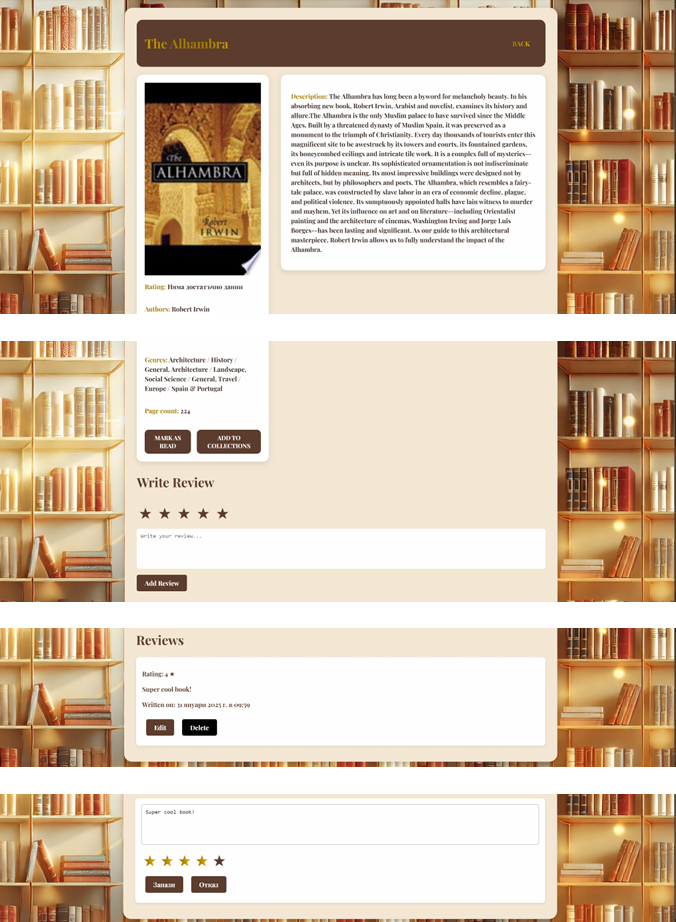

# 📚 **BookWise** - Personal Reading Journal & Book Recommendations

**BookWise** is a platform for managing personal reading journals, creating book lists, generating personalized recommendations, and offering social functionalities to share reviews and annotations. The main idea of the project is to provide a convenient and user-friendly environment for book lovers to enhance both personal and shared reading enjoyment while encouraging more people to develop and gain new knowledge.

## 🎯 **Project Goals**

- 📖 Create a centralized personal reading journal where users can record their read books, add annotations, and track their progress.
- 🤖 Integrate personalized book recommendations using a specialized Python microservice that analyzes user data and preferences.
- 🔐 Ensure safe and secure communication between users and the system.
- 📝 Additional functionalities like reviews, book lists, and reading challenges.

## 🛠️ **Technology Stack**

### 1. **Backend - Spring Boot** 🌐

- **Role:** The main backend of the application.
- **API Server:** Spring Boot handles RESTful API requests for system functionalities like user registration, login, profile management, and book recommendation processing.
- **Security Management:** JWT (JSON Web Tokens) are used for session management, issuing tokens post-authentication for subsequent requests.
- **Firestore DB Integration:** Manages user data, books, and reviews using Firebase Admin SDK for Java.
- **External API Integration:** Communicates with Google Books API to fetch book details and uses a Python microservice for generating recommendations via RabbitMQ.

### 2. **Frontend - React (Web)** 🌍

- **Role:** The web interface provides a unified environment for users and communicates with the backend for data processing.
- **UI Features:** Interactive and user-friendly UI for desktop browsers, including registration, login, user profiles, book viewing, adding reviews, annotations, and managing book lists.
- **JWT Tokens:** Used for authentication, stored in local storage, and sent in HTTP request headers for secure access to resources.
- **Firebase Integration:** Manages user authentication and stores data (reviews, annotations, book lists) via Firebase SDK for JavaScript.

### 3. **Python Microservice** 🐍

- **Role:** A microservice that uses machine learning models to process data and generate personalized book recommendations.
- **Google Books API Integration:** The service communicates with Google Books API to fetch book data.
- **Text Processing & Analysis:** Utilizes libraries like transformers, KeyBERT, SentenceTransformers, scikit-learn, and spaCy for processing user queries and filtering results.

### 4. **Database - Firebase DB** 💾

- **Role:** A centralized database for storing user data and metadata for books.
- **Real-Time Sync:** Every change is synchronized instantly, enabling real-time updates for annotations, reviews, and preferences.
- **Firebase Authentication:** Used for managing user logins and ensuring security.

## 🔑 **Key Features**

### 1. **User Registration & Management** 📝

- **Registration:** Users can sign up with email/password, and email verification is handled via Firebase Authentication and SMTP.
- **Login & Sessions:** JWT tokens are generated for session management, including Google login via Firebase Authentication.
- **Profile Management:** Users can update their data, such as email, password, or username, through `UserController`.

### 2. **Book Recommendations** 📚

- **Request Handling:** User queries are sent to `RecommendationController` and processed by the Python microservice via RabbitMQ.
- **Recommendation Generation:** The microservice generates book suggestions based on user preferences and Google Books API data.
- **Parallel Processing:** Uses multi-threading to process requests and improve performance under high load.

### 3. **Reading Diary & Book Lists** 📓

- **Personal Journal:** Users can add books with annotations via the `ReadingDiaryController`.
- **Book Lists:** Users can create and manage book lists via the `CollectionController`.

### 4. **Challenges** 🎯

- **Create & Join:** Administrators can create challenges based on genres, page count, authors, etc., and users can join and track progress.
- **Progress Tracking:** The system automatically updates progress when users mark books as read.

### 5. **Reviews & Ratings** 🌟

- **Add & Edit Reviews:** Users can add, edit, or remove book reviews via `ReviewController`.
- **Public & Private Reviews:** Reviews can be marked public or private.
- **Average Rating Calculation:** The system calculates an average rating based on all published reviews.

### 6. **Security & Sessions (JWT)** 🔐

- **Session Management:** JWT tokens are used for authenticating users. Each token contains user information and expiration time.
- **Access Control:** API endpoints are secured, allowing access based on user roles (e.g., regular users, administrators).
- **HTTPS & Token Validation:** All communication is encrypted, and JWT tokens are validated before granting access to protected resources.

### 7. **Book Search & View** 🔍

- **Book Search:** Users can search for books by keywords, author, genre, ISBN, and more.
- **Book Details:** Users can view detailed information about books, and popular books are cached for faster access.

## 📥 **Documentation**

You can find more detailed documentation for the project in the [documentation folder](docs/BookWise.pdf). 

## 📸 **UI**

## Authors
- Nikolay Nikolaev
- Hristina Gadzheva